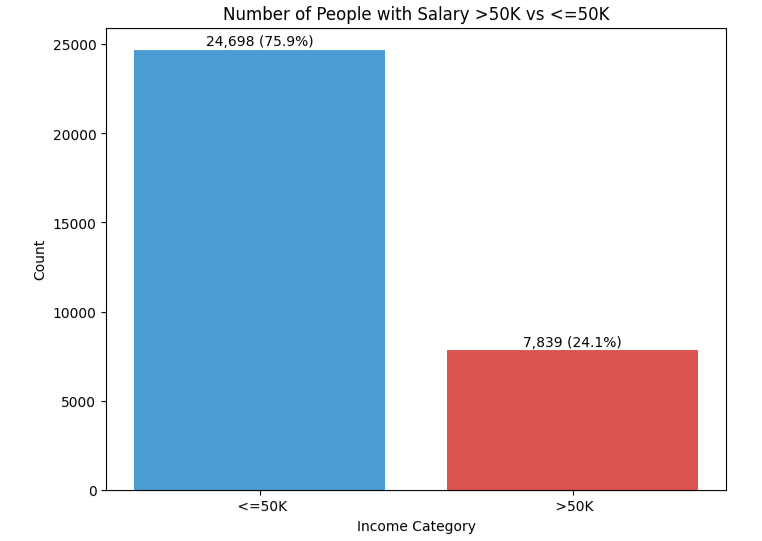
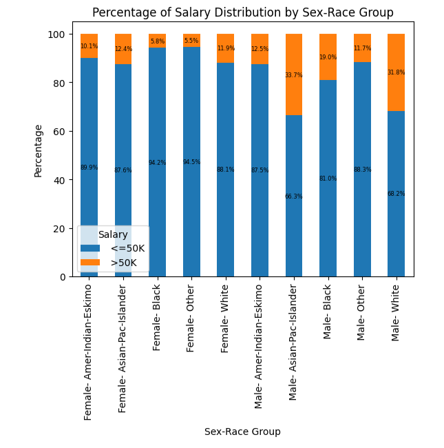
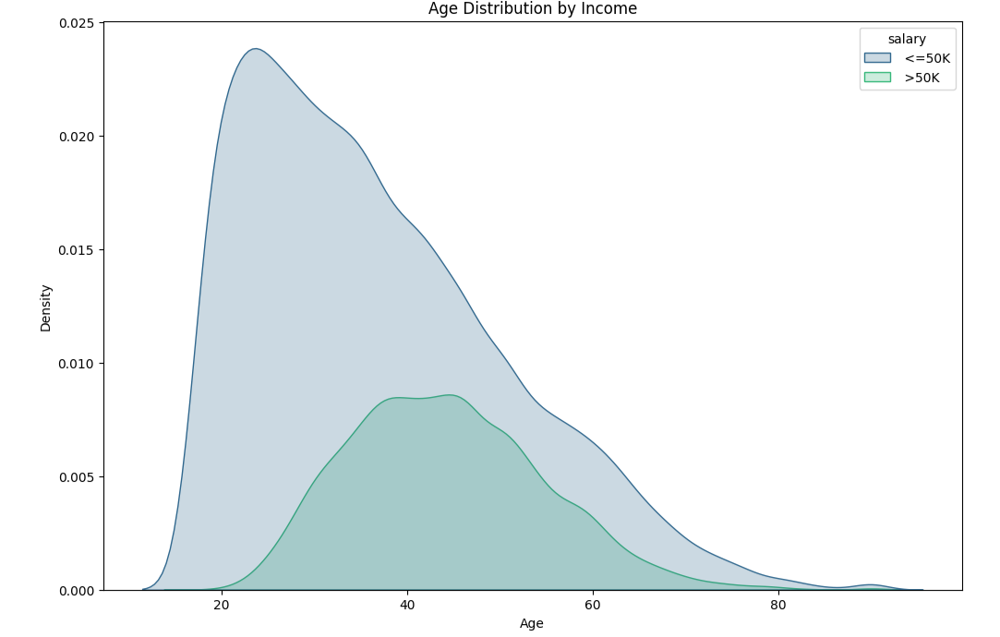
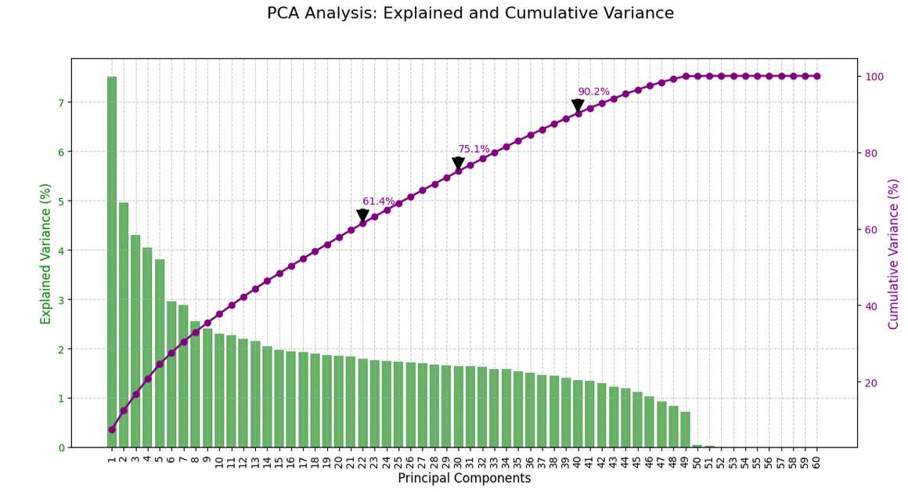
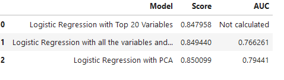

# Logistic Regression Model to Predict Income Levels Using Demographic and Socioeconomic Factors

- **Objective**: Predict whether an individual earns more or less than $50,000 annually based on various demographic and socioeconomic characteristics.

- **Analysis**: Examine features such as age, education, occupation, and marital status to identify key determinants of income.
  
- **Model**: 3 Different Logistic Regression Models were conducted.

- **Impact**: Develop a predictive model to offer insights into the socioeconomic factors associated with higher or lower earnings, helping to understand income disparities and inform related decisions.

## Resources Used

**Python Version**: 3.12.1

**Packages**: pandas,numpy,sklearn,matplotlib,seaborn,scipy, statsmodel, plotnine, IPython.display

**Dataset**: https://archive.ics.uci.edu/dataset/2/adult

## Data Cleaning

For the data cleaning process it was only needed to eliminate 24 duplicated rows

## Exploratory Data Analysis

Many different graphs were made to understand the dataset better. Below some of them. 

The following graph plots the y, how many people are making more or less than 50k.

The next two, how demographics impact salaries.

## Model Building

In order to conduct the models, it was necessary to convert the categorical variables to dummies. Furthermore the data was scaled, and since these models are supervised, later divided into test and train sets, with a test size of 25%. 
For some of the models, PCA was as well conducted. Gridsearch was used too to select the best parameters.

3 diferent models were conducted and evaluated according to the AUC (are under the curve) and their accuracy score.
The models were:

- Logistic Regression with top 20 variables
- Logistic Regression with all the variables
- Logistic Regression with PCA

 ## Model Performance

The best model is Model 2 **"Logistic Regression with PCA"**. It demonstrates robust performance with an accuracy score of **0.85** and an AUC of **0.794**. The high accuracy indicates that the model correctly predicts the outcome in 85% of the cases, showing that it fits the data really well, meaning it’s doing a good job at making predictions based on the dataset. The AUC of 0.794, while slightly below the ideal value of 1, reflects a good level of discrimination between the positive and negative classes. This means the model does a good job of telling the difference between the two outcomes, but there’s still some potential to make it even better. 

